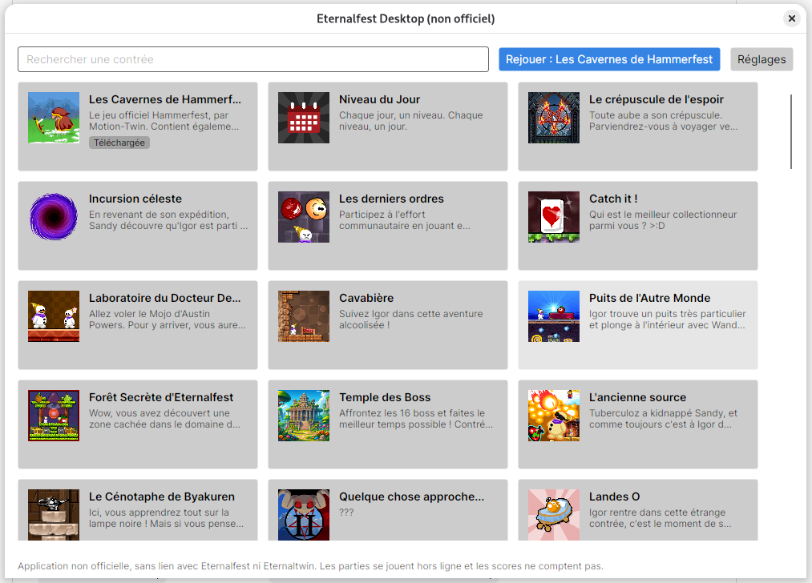

# Eternalfest Desktop

[](https://github.com/cmnemoi/eternalfest-desktop/actions/workflows/continuous-integration.yml)
[](https://github.com/cmnemoi/eternalfest-desktop/actions/workflows/continuous-delivery.yml)
[](https://codecov.io/gh/cmnemoi/eternalfest-desktop)

> **Unofficial.** A personal project, not affiliated with, endorsed by or supported by the Eternalfest or Eternaltwin teams.

Play any public [Eternalfest](https://eternalfest.net) contrée offline, with every mode and option unlocked, by double-clicking an app. No terminal, no cloned repositories, no build tools, no account.

Eternalfest Desktop downloads a contrée once from the public Eternalfest API, then plays it forever without network in Adobe's Flash Player 32, the one the Eternalfest website and the Eternaltwin app use, against a tiny fake Eternalfest server running inside the app. Nothing is ever sent to eternalfest.net: this is just for fun, scores don't count. On systems the app ships no Flash Player for, contrées play in [Ruffle](https://ruffle.rs).



Looking to play online, with your account and leaderboards? Use the official [Eternaltwin desktop app](https://eternaltwin.org/docs/desktop).

## Install

Download the app for your system from the [latest release](../../releases/latest):

- **Windows** (x64): [the installer](../../releases/latest/download/eternalfest-desktop-win-Setup.exe), which needs no administrator rights and adds the app to the Start menu, or [the portable zip](../../releases/latest/download/eternalfest-desktop-win-Portable.zip) to extract anywhere. The app isn't signed yet, so Windows SmartScreen may warn on first launch: choose *More info*, then *Run anyway*.
- **Linux** (x64, glibc 2.34 or newer: Ubuntu 22.04, Debian 12, Fedora 35…): [the AppImage](../../releases/latest/download/eternalfest-desktop.AppImage), to make executable (`chmod +x eternalfest-desktop.AppImage`) and run, or the `tar.gz` of the release to extract anywhere. Either adds itself to the applications menu. Flash Player needs an X11 or XWayland session and the usual desktop libraries (GTK 3's, which it shares, and ALSA or PulseAudio); it ships its own GTK 2 and NSS.
- **macOS** (Apple Silicon): [the app](../../releases/latest/download/eternalfest-desktop-osx-Portable.zip), to extract and drag into *Applications*. Contrées play in Ruffle, since Adobe's Flash Player for Mac is Intel only. The app isn't signed by an Apple developer, so macOS refuses to open it the first time: open *System Settings › Privacy & Security*, and choose *Open Anyway* next to "Eternalfest Desktop".

Nothing else to install. Downloaded contrées, the saved catalog, preferences and logs go to `%LOCALAPPDATA%\EternalfestDesktop` on Windows, `~/Library/Application Support/EternalfestDesktop` on macOS and `~/.local/share/eternalfest-desktop` on Linux.

## Status

Early development. See the [plan](docs/plan.md).

## Development

Requirements: [mise](https://mise.jdx.dev), which installs the .NET 10 SDK (`mise install`). Every project command is a mise task (`mise tasks` lists them):

```sh
mise run hooks                        # once per clone: text hygiene on commit, mise run ci on push
mise run build                        # the pinned Flash projector (eng/flash-player.json, needs cc on Linux) and Ruffle (eng/ruffle.json), then the app
mise run test                         # mise run coverage measures it, mise run ci adds the format check
mise run format                       # mise run check fails on unformatted code instead
mise run mutation -m '**/StageSize.cs' # how many mutants the tests kill (Stryker.NET), report in artifacts/stryker
mise run app                          # the app
mise run cli play <id> --new-player   # a developer console: catalog, game, download, downloaded, play
mise run package [win-x64]             # what a release of version.txt publishes for this machine or win-x64, in artifacts/packages (Linux needs mksquashfs, macOS packs on a Mac)
```

Commits follow [Conventional Commits](https://www.conventionalcommits.org). Once the CI passes on `main`, [release-please](https://github.com/googleapis/release-please) keeps a release pull request open with the next version (`version.txt`) and the changelog; merging it publishes the Windows, Linux and macOS downloads, and their update feeds, on GitHub Releases.

- [Plan and delivery lots](docs/plan.md)
- [Architecture decision records](docs/adr)
- [Specs](docs/specs): behaviors carry stable IDs such as `{#backend::serves-cached-blobs}`, referenced from tests and code with `@spec`.

## License

[GPL-3.0](LICENSE). Contrées are downloaded from eternalfest.net and belong to their authors; they are never redistributed by this project.
